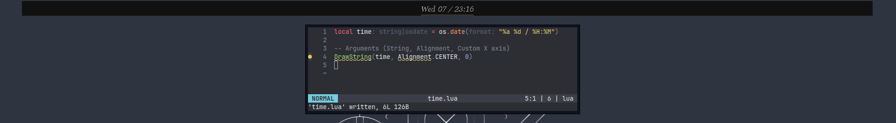

# MiBar

> [!WARNING]
>
> MiBar is at a usable 


(image generated with [github-profile-header-generator](https://github.com/leviarista/github-profile-header-generator?tab=readme-ov-file))

MiBar is a simple Linux X11 status bar with Lua support

## Description

MiBar is a simple Linux X11 status bar built with the C++ programming language. The application uses 2 external libraries, XCB to interact with the X server, and sol2 to run user made lua scripts.

MiBar is supposed to be customizable and easy to configure. This is the reason for using the Lua language for plugins as it makes it easy to develop for MiBar.

## Contents

* [Getting Started](#getting-started)

* * [Dependencies](#dependencies)

* * [Installing](#installing)

* * [Running MiBar](#running-mibar)

* [Configuration](#configuring)

* [Images](#images)

* [Plugin Development](#plugin-development)

* [In Development](#in-development)

* [License](#license)

## Getting Started

MiBar has migrated from a C header file for configuration, to a .bar configuration file. This means you can now build MiBar once and change settings without having to build again.

### Dependencies

* git
* cmake
* make
* All xcb libraries
* sol2

### Installing

Building from source is as quick as running the following commands once.

```
$ git clone https://github.com/JJoeDev/MiBar.git --recursive
$ cd MiBar
$ cmake -DCMAKE_BUILD_TYPE=Release .
$ make -j
```

### Running MiBar

MiBar can be run without any arguments, this will make it look for its own configuration file `config.bar` in `~/.config/MiBar` if this file does not exist the app cannot launch. There is an example file in the example repo
```
$ ./bin/MiBar
```

MiBar can also be run with some arguments

```bash
./bin/MiBar -h
./bin/MiBar --help
```

using the -h or --help flag MiBar will just display a very short help list

```bash
./bin/MiBar -c filename
./bin/MiBar --config filename
```

using the -c or --config flag you can specify a custom configuration file name. MiBar will still look in `~/.config/MiBar` for this file.

Note that adding a file extention with this flag does not help. If the .txt extension is added MiBar will look for `filename.txt.bar`

## Configuration

MiBar uses its own configuration format that is designed to be really simple to use. For a demonstration, here is the example config file included in this repo

```bar
* Comment. Comments can only be placed before the ':' as to not interfer with some settings

* Colors. Colors use the hexadecimal format and are prefixed with 0x
* Hexadecimal values go from 0 to F (0, 1, 2, 3, 4, 5, 6, 7, 8, 9, A, B, C, D, E, F)
* The colors are formatted as 0xRR GG BB where RR, GG, and BB reprecent red green and blue
* MiBar has support for 5 colors, all assigned a value as below
* Currently not all values are in use, but they will be in the future

Background: 0x111111
Foreground: 0x999999
Color1: 0x777777
Color2: 0x555555
Color3: 0x333333

* TargetMonitor is the monitor MiBar should locate and move to

TargetMonitor: HDMI-0

* Currently MiBar only supports fronts built in to X.
* These fonts can be listed with a utility like 'xlsfonts' in a terminal

Font: lucidasans-10
FontFallback: fixed

* The transform values are additive to the information recieved from TargetMonitor
* This means if the monitor is 1920 wide and BarWidth is 0 then the bar is also 1920 wide
* To make the bar slimmer BarWidth needs to be a negative number
* BarHeight is not aditive and is 0 high by default
* BarX and BarY is the monitor coordinates for where to draw the bar at

BarWidth: 0
BarHeight: 32
BarX: 0
BarY: 0

* The following settings are to render a small line under every rendered component on the bar
* UseUnderline will be false unless its value is directly "true"

UseUnderlines: true
UnderlineHeight: 3
UnderlineOffsetX: 0
UnderlineOffsetY: 0
```

## Images




## Plugin Development

MiBar allowes for users to create their own bar by creating plugins that do what they want them to do. Lua is a simple and easy scripting language with tons of documentation online.

### Creating a Plugin

* **Director:** Plugins should be located in ```~/.config/MiBar/plugins```
* **Available Functions** MiBar currently only exposes one function to the plugins, Here is an example of how to use it
* * ```DrawString(text, alignment, x_position)```: This function draws a string to the status bar
* * - ```text```: This is the string that will get displayed on the status bar
* * - ```alignment```: This is an alignment option (``LEFT``, ``CENTER``, or ``RIGHT``)
* * - ```x_position```: This is an added position on top of the alignment option

**Time.lua**: Time.lua is a simple plugin that simply displays the current time on the center of the bar

```lua
local time = os.date("%a %d / %H:%M")

DrawString(time, Alignment.CENTER, 0)
```

For a visual example of this script take a look at the third [image](#images)

## In Development

This is a simple list of what I am working on for future releases

| List of stuff I want to work on |
| - |
| DPI Scaling |
| Initial boot auto creates config.bar |
| Initial boot auto grabs primary monitor for config.bar |
| Renderer switching to cairo or something similar |

## License

This project is licensed under the GNU General Public License v3.0 License - see the [LICENSE](./LICENSE) file for details
