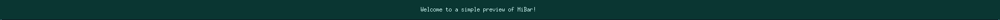
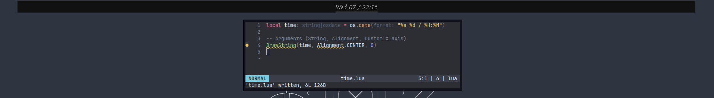

# MiBar

Version 2

> [!WARNING]
> 
> MiBar 2.0 is under heavy development and is not even close to being usable


(image generated with [github-profile-header-generator](https://github.com/leviarista/github-profile-header-generator?tab=readme-ov-file))

## Description

MiBar is a simple and hackable X11 Linux status bar. It is built using the C++17 programming language, communicating directly to the X server using XCB.

MiBar is a hackable status bar as it allowes the user to write their own lua scripts, and control what is displayed on the status bar, in the form of "modules". The main config file for MiBar is supposed to be quick and easy to understand and edit.

## Contents

* [Getting Started](#getting-started)

* * [Dependencies](#dependencies)

* * [Installing](#installing)

* * [Running MiBar](#running-mibar)

* [Configuration](#configuring)

* [Images](#images)

* [In Development](#in-development)

* [License](#license)

## Getting Started

MiBar has a custom config file for configuring some colors and other bar related settings. This config file should be located at `~/.config/mibar/config.mibar`

### Dependencies

* cmake
* ninja
* All xcb libraries

### Installing

Currently MiBar is not in any Linux package repositories, so you will have to build from source.

```
$ git clone --recursive https://github.com/JJoeDev/MiBar.git
$ cd MiBar
$ cmake -DCMAKE_BUILD_TYPE=Release .
$ ninja
```

Now there should be a bin directory containing the MiBar executable.

### Running MiBar

In the current state of MiBar running the app is not super interesting. I would suggest running the bar in a terminal so you can easily send a stop signal to it using `ctrl+c`

Want to run the app anyways? Its as simple as typing `./MiBar` in the bin directory created earlier

## Configuration

In the current version of MiBar V2.0 there is no configuration yet. But once it is being implemented it will follow the easy to read format that is shown below.

```MiBar
# Comment
# MiBar will use the Key:Value style where the : is the seperator

Background: #202020
Foreground: #2E2E3E

Font: "0xProtoNerdFontRegular"

# White space will be removed at runtime by MiBar
```

## Images

These images are from MiBar V1.0






## In Development

Here is a list of my current priorities for what to develop on next. This list may get updated at any time.

- [ ] Rendering engine

- [ ] Configuration parser

- [ ] Lua Integration

- [ ] TTF and or OTF font support

- [ ] Eextended Window Manager Hints and ICCCM

## License

This project is licensed under the GNU General Public License v3.0 License - see the [LICENSE](./LICENSE) file for details
