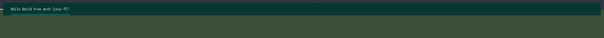

# MiBar


(image generated with [github-profile-header-generator](https://github.com/leviarista/github-profile-header-generator?tab=readme-ov-file))

> [!WARNING]
>
> MiBar is under heavy development and should not be used yet.

## Table of content
[Intro](#intro)

[Current state](#current-state)

[Current and future features](#features--planned)

[How to build, run & configure](#building-and-running)

- [Building](#building)

- [Configuring](#configuration)

- [Custom modules](#creating-custom-modules)

[Dependencies](#dependencies)

[Images](#images)

[Getting involved](#getting-involved)

## Intro
MiBar is a C++17 app designed to be a user-friendly and configurable status bar for the X11 window system on linux. The goal is to create a minimal and light weight status bar with easy customization and extendability so users can create their own bar components.

## Current state
MiBar is in the early stages of development so components like configuration are not 100% in place and will have to take place in a C header file for now, this has the consequence of requireing the application to be recompiled every time the configuration file is modifed. 

Custom components are also not implemented yet and neither is components like: time, volume, and so on.

## Features (+ planned)

*More features might be added in the future*

* (Basic Implementation) **Modules:** MiBar would like for users to be able to create their own modules for the bar to allow for even more customizability
* (planned) **Configuration:** At some point in the future MiBar should move away from the C header file to  a toml or json approach for configuration
* (planned) **Fonts** Currently MiBar only supports X11 fonts (use xlsfonts to see all fonts) in the future we should switch to cairo

## Building and running
The current version includes a config file in the form of a C header file located in ``miBar/src/general.config.h``. Each time this config file is modified a recompilation is required.

### Building

Before you can build you need to make sure libxcb is installes and sol2 should also be installed

*On Arch linux*

```
$ sudo pacman -S libxcb
$ yay -S sol2
```

*Building*

```
$ cd /Path/To/MiBar/CMakeLists.txt
$ cmake . -DCMAKE_BUILD_TYPE=Release
$ cmake --build .
$ ./bin/MiBar
```

### Configuration
The current method to configure the bar is to take a look in [general.config.h](./src/general.config.h) for configuration directly to the bar

To get modules on the bar such as text or a clock you will have to find a lua script for MiBar and move it to ``$HOME/.config/MiBar/plugins``

[general.config.h](./src/general.config.h)
```C
#ifndef MIBAR_GENERAL_CONFIG_H
#define MIBAR_GENERAL_CONFIG_H

// Colors to use
#define BACKGROUND 0x0A3632
#define FOREGROUND 0xC6EFEB
#define COLOR1 0x115852
#define COLOR2 0x237E76
#define COLOR3 0x3CA99F

// Monitor for MiBar to find
#define TARGET_MONITOR "HDMI-0"

// Bar configuration
#define BAR_WIDTH 0
#define BAR_HEIGHT 40
#define BAR_X 0
#define BAR_Y 0

// Underline configuration
#define ENABLE_UNDERLINE 1
#define UNDERLINE_HEIGHT 3
#define UNDERLINE_X_OFFSET -1
#define UNDERLINE_Y_OFFSET -10

// Currently only PADDING_TOP & PADDING_LEFT is in use
#define PADDING_TOP 10
#define PADDING_RIGHT 0
#define PADDING_BOTTOM 0
#define PADDING_LEFT 5

#endif
```

## Creating custom modules
At this point in time the bar only supports drawing text to the bar, all in the same spot. MiBar has exposed a function to lua called ``Draw()`` that only accepts a string as its argument.

```cpp
void Draw(const std::string& str);
```

## Dependencies
[xcb](https://xcb.freedesktop.org/) is used to interact with the X11 server

[sol2](https://github.com/ThePhD/sol2) Is used to interact with lua

## Images



## Getting involved

Currently, the project is not actively seeking contributions. However, if you have any suggestions or find potential improvements, feel free to reach out. Well-explained pull requests with clear descriptions and code comments will be considered for future versions.